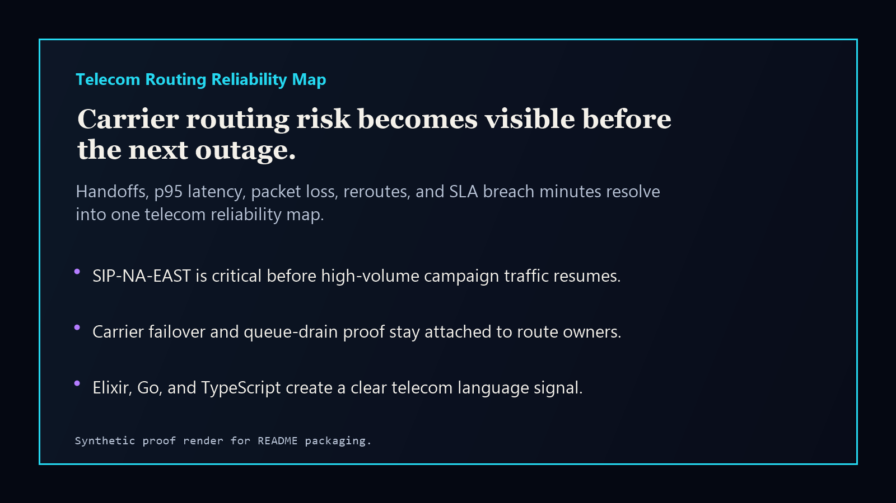
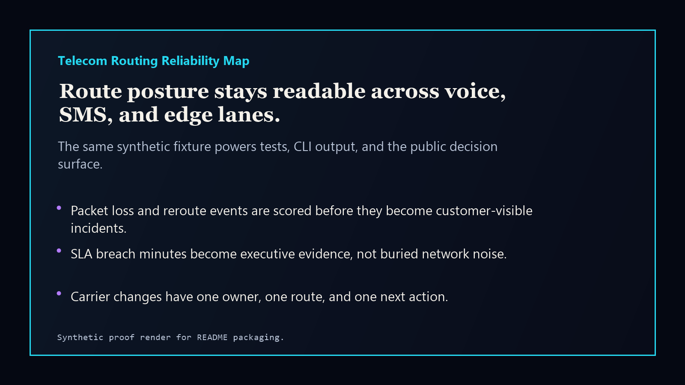

# telecom-routing-reliability-map

[](https://github.com/mizcausevic-dev/telecom-routing-reliability-map/actions/workflows/ci.yml)
[](https://github.com/mizcausevic-dev/telecom-routing-reliability-map/actions/workflows/pages.yml)
[](LICENSE)

Telecom Routing Reliability Map is a carrier-routing control-plane prototype for exposing handoff drift, p95 latency, packet loss, reroutes, and SLA breach minutes before they become a customer-visible outage.

## Why this exists

- Voice, SMS, and edge routes often fail through gradual drift rather than one clean incident.
- Engineering, support, and revenue teams need the same route posture before campaigns, launches, or carrier changes.
- Executives need a board-readable answer to which route is exposed, which owner is accountable, and what action should move first.

## What it ships

- TypeScript scoring library and static web surface.
- Go route reliability CLI.
- Elixir signal extraction script for telecom/concurrency language signal.
- Synthetic telecom routing fixture, screenshots, docs, and GitHub Pages release rail.

## Local run

```powershell
npm install
npm run verify
```

Elixir is validated in CI. If Elixir is available locally:

```powershell
elixir elixir/reliability_signal.exs fixtures/route-reliability.json
```

## Screenshots





## Security

This repo uses synthetic routing data only. Do not commit production CDRs, IMSI/MSISDN values, carrier contracts, customer traffic logs, credentials, or private network topology.

